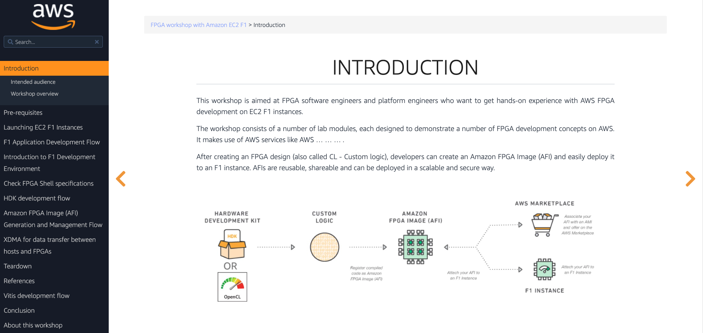

# fpga-development-on-ec2-f1

This is the source repo for the [FPGA with EC2 F1 workshop](https://fpga-development-on-ec2-f1.workshop.aws/)

## Contributing

Please check the [contributing guidelines](CONTRIBUTING.md) first. If you would like to contribute, you can run this workshop locally by following the 2 provided options:

### option 1: using local docker

1. clone this repository to your environment

2. assuming you have docker installed, run `make` in the repo root dir, and go to localhost:8080 for the local version of this workshop.

3. create your dev branch and commit and open a pull request to provide the errata/content/updates.

### option 2: using local hugo server

Alternatively if you are not able to run containers with docker, you can build and run this workshop website using hugo.

1. Install hugo

On a Mac:

Install Hugo: `brew install hugo`

On Linux:

[Install Hugo locally](https://gohugo.io/overview/quickstart/) by downloading hugo from the [releases page](https://github.com/gohugoio/hugo/releases)

Extract and save the executable to $HOME/bin or /usr/local/bin

2. The after cloning this repository, run `hugo server` in the root dir and the website preview will be available at http://localhost:1313/

3. Checkout a dev branch and edit the workshop. Commit and open a pull request to provide the errata/content/updates.

## Security

See [CONTRIBUTING](CONTRIBUTING.md#security-issue-notifications) for more information.

## License

This library is licensed under the MIT-0 License. See the LICENSE file.

