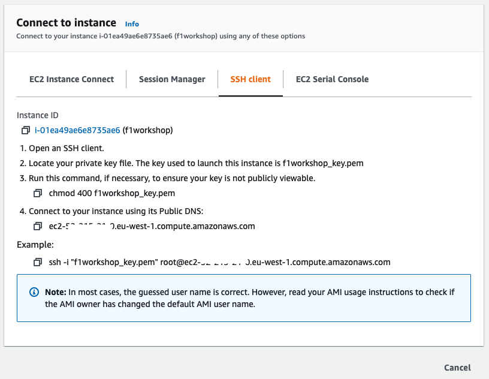
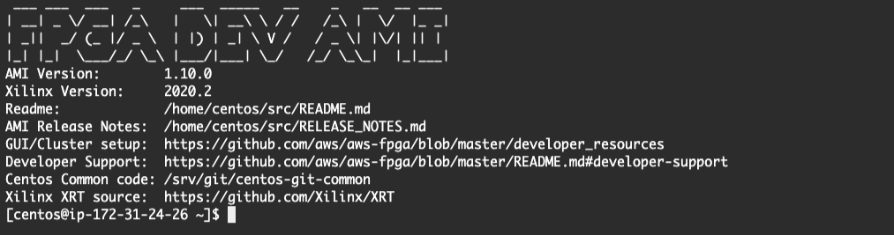
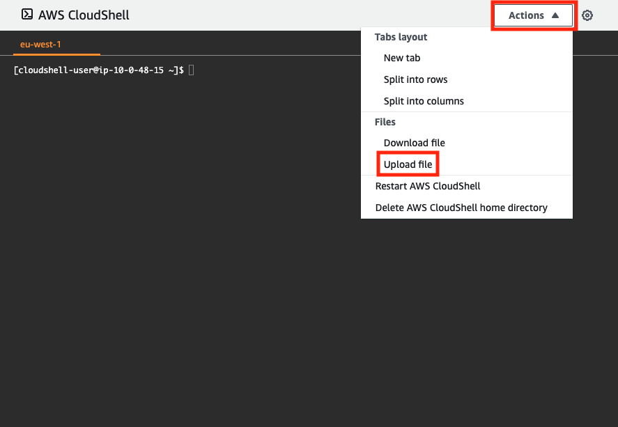
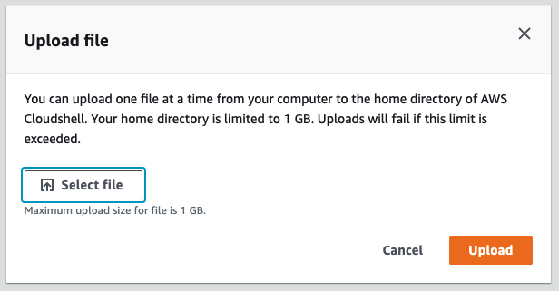
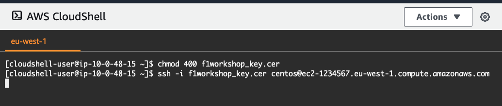
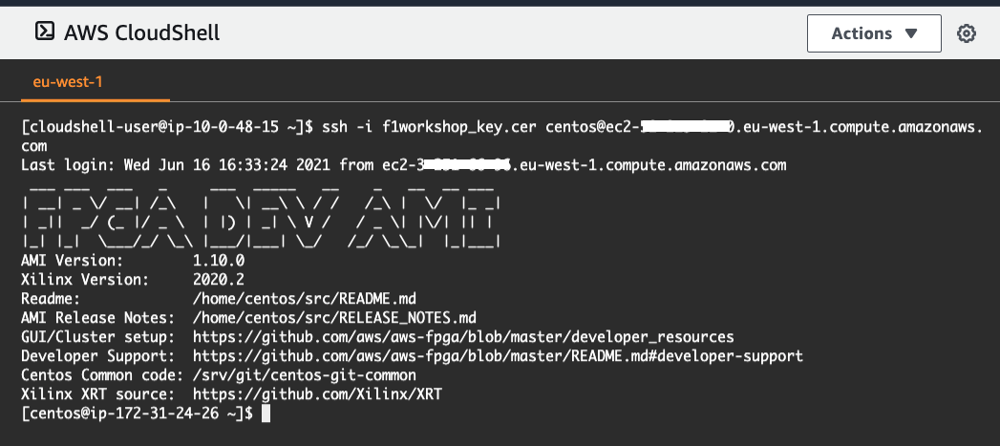

+++
title = "Launching EC2 F1 Instance"
chapter = false
weight = 28
+++

- [Launch an F1 instance]( "Launch an F1 instance")
- [Creating an F1 instance]( "Creating an F1 instance")
- [Review the F1 instance you created]( "Review the F1 instance you created")
- [Login to instance]( "Login to instance")
- [Setting Locale]( "Setting Locale")
- [Troubleshooting failing SSH login attempts]( "Troubleshooting failing SSH login attempts")

### Launch an F1 instance

Select the N. Virginia region (not Ireland as the screenshot shows) in the top right and click on "Launch instance" button (It will dropdown to 2 choices, we are not launching an instance from a template)


### Creating an F1 instance

Step 1 On the Amazon Machine Image (AMI) screen, select the OS image. Select AWS Marketplace and type “FPGA” in the search form. Click Select to the right of the FPGA Developer AMI that appears.


You will be taken to the FPGA Developer AMI page of AWS Marketplace, so here click “Continue” at the bottom right of the screen.


Step 2 On the Select Instance Type screen, check f1.2xlarge and click “Next: Configure Instance Details” at the bottom right of the screen


Step 3 We do not change the Instance Configuration Details and skip this step to click “Next: Add Storage” at the bottom right of the screen


Step 4 On the Add Storage screen set the following settings: 
- set the size to "120GiB" for the first root volume 
- for the second "5GiB" EBS volume check the "Delete om Termination" box. 

When you are done, click “Next: Add Tags” at the bottom right of the screen


In step 5, give the instance a name (can be any string). When you first click “Add tag”, you will see the following screen, so enter any string in the “Value” part. In our example we set the Name tag of "f1workshop" for our f1 instance.


Step 6 Under Security Group Settings, select the security group you just created. After selecting, click the “Review and Launch” button at the bottom right of the screen


Step 7: On the confirmation screen of the instance creation, press the “Launch” button. Then the key pair selection screen will be displayed. Select the key pair you just created and click “Launch Instance”

**In Select a key pair, make sure to select the key pair you created**


### Review the F1 instance you created

When the success screen appears, go to the instance list screen by “View Instances”


Select the "f1workshop" instance


From the Details tab, copy the public DNS host name (or public IP address)


### Login to instance

There are multiple ways to connect to your EC2 instance, depending on OS type and wether it has a public ip or only private. *Also be aware that you might need to disconnect from VPN to make it work.*

Logging in with SSH clients such as: putty or terraterm on Windows, Terminal in OSX, and the various Terms in the Linux distriibutions.

When logging in from Windows with teraterm
- Start TeraTerm (ttssh.exe) http://sourceforge.jp/projects/ttssh2/
- Enter the host name of the instance to connect
- Specify SSH2
- Username: **centos**
- Select and connect to the private key file obtained when creating the Keypair 

SSH login to instance
- When logging in from Mac/Linux 
- Log in via the command line from your Terminal




After successful login to F1 instance, the following screen will be displayed:



**Browser Login Option** : Logging in with AWS CloudShell via a webbrowser


* Launch CloudShell from the AWS service list screen (**Hint:** or enter Cloudshell in the top search bar in the webconsole)

* Once CloudShell has launched, **upload** the private key file obtained when creating the Keypair previously (Our key name is: "f1workshop_key.cer")





* Log in on the command line and first set the right Unix permissions for the key:

```bash 
$ chmod 400 keypair_name.pem
```

* connect to the F1 instance from the CloudShell:

```bash
$ ssh -i keypair_name.pem centos@ec2-dns-host-address`
```



After successful login to F1 instance, the following screen will be displayed



### Setting Locale (optional)

Depending on your Terminal's locale setting, when logging in to your instance you might see this line:

```bash
...

-bash: warning: setlocale: LC_CTYPE: cannot change locale (UTF-8): No such file or directory

...
```

To fix this, execute:

```bash
$ sudo localectl set-locale LANG=en_US.UTF-8 && sudo localectl set-locale LC_CTYPE=en_US.UTF-8
```

### Troubleshooting failing SSH login attempts

* Is the instance fully launched?

* Is it booting as specified at startup?

* Does the specified SecurityGroup have 22 (SSH) enabled for Inbound?

* Do you specify the key file corresponding to the specified Key Pair?

* Does the private key file have 400 permissions? (Unix)

