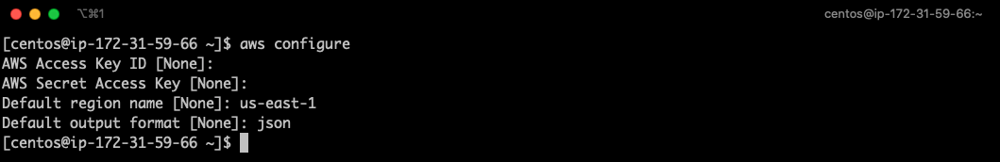

+++
title = "Setting up an AWS CLI environment"
chapter = false
weight = 29
+++

- [What is the AWS CLI?]( "What is the AWS CLI?")
- [Create IAM Roles]( "Create IAM Roles")
- [Attach IAM roll to EC2]( "Attach IAM roll to EC2")
- [AWS CLI setup on Linux]( "AWS CLI setup on Linux")

In this chapter we are going to setup the AWS CLI and create IAM roles.

### What is the AWS CLI?

The [AWS Command Line Interface (CLI)](https://aws.amazon.com/cli) is a unified tool to manage your AWS services. With just one tool to download and configure, you can control multiple AWS services from the command line and automate them through scripts.

- Same operation as GUI on command line
- Automate and labor-saving various AWS operations with scripts
- User Data can also be specified
- Operate from anywhere 
- Written in Python
- Works on Windows, Mac and Linux

### Create IAM Roles

[Identity and Access Management (IAM)](https://aws.amazon.com/iam/) roles provide permissions to work with AWS resources using the AWS CLI

- Create IAM Roles
- Gives you permissions to work with AWS resources from the AWS CLI
- Attaching IAM roles to EC2 instances 
- Identities separate from IAM users
- Install the AWS CLI on your EC2 instance
- Run AWS CLI commands

1. Go to the IAM service screen by selecting IAM or by typing IAM in the top search bar


IAM is in the category 'Security, Identity, and Compliance'

2. On the IAM screen, select “Roles” on the left of the screen and click the “Create Role” button


3. The `Create Role Wizard` will launch, so you can choose 

- Step 1. select AWS Service and EC2, then select `'Next: Permissions'` in the lower right corner of the screen 


- Step 2. Check `'AdministratorAccess'` and select `'Next: Tags'` at the bottom right of the screen.


{}
In non-lab environments, you should not use the highest permission level the 'Administrator' has, but create a Role with Policy attached with required permissions only.
{}

- Step 3. We skip this step and are not adding Tags for the moment. Click the `'Next: Review'` button

- Step 4. In the role Review step we need to provide a role name. In our example we provide as role name: `'fpga-f1-workshop-instance-role'`. And click `'Create role'`


Enter and select “Create Role” at the bottom right of the screen

### Attach IAM roll to EC2

1. Go to EC2 by selecting EC2 Service from the AWS Management Console, 'EC2' is in the category of computing


2. Select “Instances” from the left menu of the EC2 screen and select the F1 instance you created. From the actions menu, select Actions > Security > Modify IAM Role.


3. Attach IAM roll to EC2. On the Change IAM Role screen, select the IAM role you just created: 'fpga-f1-workshop-instance-role' and apply it with the Save button.


If the success screen is displayed, you're done


### AWS CLI setup on Linux

Login to the workshop instance we have deployed in previous lab. SSH into the F1 instance. Run the `aws configure` command to set up the AWS CLI environment and press enter 2 times to skip entering values for AWS Access Key ID and AWS Secret Access Key. We set Default region name to us-east-1 and Default output format to json.



#### AWS CLI Operation Check 

Run the EC2 operation command as shown below to see if the information is output

Show Regions

```bash
$ aws ec2 describe-regions
```

List Key Pairs

```bash
$ aws ec2 describe-key-pairs
```

List Security Groups

```bash
$ aws ec2 describe-security-groups
```

If the CLI operation check succeeds - and there are no errors returned, it means the EC2 instance is asuming the IAM role and has access to the AWS platform.

#### S3 Bucket creation

Now, lets' execute S3 operation commands to create an S3 bucket and upload files to it.

In this example we are creating an S3 Bucket named "guest01-2021-07-10" **but change the name of YOUR bucket something unique, i.e. your "name-surname-xx-yyyymmdd"**

```bash
$ aws s3 mb s3://guest01-20210710
```

```bash
$ aws s3 cp /etc/hosts s3://guest01-20210710
```

