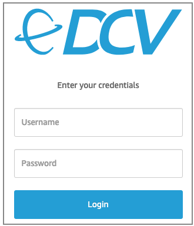
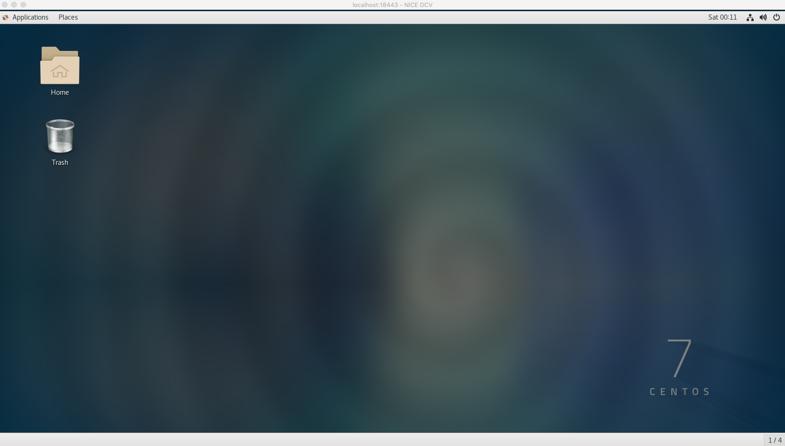

+++
title = "Setting up a GUI environment (NICE-DCV deployment)"
chapter = false
weight = 30
+++

- [GUI FPGA Development Environment with NICE DCV]( "GUI FPGA Development Environment with NICE DCV")
- [What is NICE-DCV]( "What is NICE-DCV")
- [Installation Process]( "Installation Process")

### GUI FPGA Development Environment with NICE DCV
This guide shows steps to setup a GUI FPGA Development Environment using the FPGA Developer AMI using NICE DCV

### What is NICE-DCV

High-performance NICE-DCV protocol enables fast streaming of desktop screens in the cloud and provides a comfortable VDI environment with smooth screen drawing.

[NICE DCV](https://docs.aws.amazon.com/dcv/latest/adminguide/what-is-dcv.html) can be used create a virtual desktop on your FPGA Developer AMI instance.

[NICE DCV](https://docs.aws.amazon.com/dcv/latest/adminguide/what-is-dcv.html) is a high-performance remote 
display protocol that provides customers with a secure way to deliver remote desktops and application streaming 
from any cloud or data center to any device, over varying network conditions. 

With NICE DCV and Amazon EC2, customers can run graphics-intensive applications remotely on EC2 instances
and stream the results to simpler client machines, eliminating the need for expensive dedicated workstations.
Customers across a broad range of HPC workloads use NICE DCV for their remote visualization requirements.
The NICE DCV streaming protocol is also utilized by popular services like Amazon AppStream 2.0 and AWS RoboMaker.

Features:

- Compatible with both Windows and Linux
- Advanced 3D graphics drawing with GPU when used in conjunction with G2 and G3 instances
- In addition, H.264 hardware encoding enables screen streaming without CPU load
- Remote access in browser with native client and HTML5 client support
- Compatible with the QS

Price:

- Use on EC2 can be used without additional license costs

The [DCV Administrator guide](https://docs.aws.amazon.com/dcv/latest/adminguide/what-is-dcv.html)
and the [User guide](https://docs.aws.amazon.com/dcv/latest/userguide/getting-started.html)
are the official resources on how to configure and use DCV.

The installation process is summarized below for your convenience.

{}
These steps may change when new versions of the DCV Server and Clients are released.
If you experience issues please refer to the [Official DCV documentation](https://docs.aws.amazon.com/dcv/latest/adminguide/what-is-dcv.html).
{}

### Installation Process

1. The FPGA Developer AMI Instance Security Group should have a rule allowing TCP Port **8443** Ingres, as created [in this step]( "Adding rules to SG") in our preparation lab. For additional guidance go to our EC2 documentation: [update the Instance Security Group](https://docs.aws.amazon.com/AWSEC2/latest/UserGuide/using-network-security.html#adding-security-group-rule)

1. Install NICE DCV pre-requisites for CentOS 7.x - *for other supported OS see: [Install NICE DCV pre-requisites](https://docs.aws.amazon.com/dcv/latest/adminguide/setting-up-installing-linux-prereq.html)*

   ```bash
   $ sudo yum -y install kernel-devel

   $ sudo yum -y groupinstall 'Server with GUI'

   $ sudo yum -y groupinstall "GNOME Desktop"
   
   $ sudo yum -y install glx-utils

   $ sudo systemctl isolate multi-user.target

   $ sudo systemctl isolate graphical.target
   ```

1. [Install NICE DCV Server](https://docs.aws.amazon.com/dcv/latest/adminguide/setting-up-installing-linux-server.html) #1 download and unpack
   
   ```bash
   $ sudo rpm --import https://d1uj6qtbmh3dt5.cloudfront.net/NICE-GPG-KEY
   
   $ wget https://d1uj6qtbmh3dt5.cloudfront.net/2021.1/Servers/nice-dcv-2021.1-10598-el7-x86_64.tgz

   $ tar -xvzf nice-dcv-2021.1-10598-el7-x86_64.tgz
   
   $ cd nice-dcv-2021.1-10598-el7-x86_64
   ```

1. [Install NICE DCV Server](https://docs.aws.amazon.com/dcv/latest/adminguide/setting-up-installing-linux-server.html) #2 install and enable
   
   ```bash
   $ sudo yum install nice-dcv-server-2021.1.10598-1.el7.x86_64.rpm nice-xdcv-2021.1.392-1.el7.x86_64.rpm

   $ sudo systemctl enable dcvserver
   
   $ sudo systemctl start dcvserver
   ```

1. Now we need to change a configuration setting in dcv in order to login using username:password combo. We are using a 'sed oneliner' to change the authentication parameter in dcv.conf

   ```bash
   $ sudo sed -i 's/#authentication="none"/authentication="system"/' /etc/dcv/dcv.conf

   # and we use grep to verify the change, where the output of bellow command should be: authentication="system"

   $ grep 'authentication=' /etc/dcv/dcv.conf
   ```

1. And finally - as we have updated the dcv configuration - we need to restart the service to propagate the changes

   ```bash
   $ sudo systemctl restart dcvserver
   
   # optionally you can verify that the server has restarted correctly:
   
   $ sudo systemctl status -f dcvserver
   ```

1. Setup the password for the "centos" user so that we can login through NICE DCV

   ```bash
   $ sudo passwd centos
   ```

1. In addition to the Security Groups rule, change the local firewall settings on the instance to allow connections to port 8443
   
   - Create a firewall rule
   
   ```bash
   $ sudo yum install firewalld # if firewalld is not installed yet

   $ sudo systemctl start firewalld

   $ sudo systemctl enable firewalld

   $ sudo firewall-cmd --zone=public --add-port=8443/tcp --permanent
   
   $ sudo firewall-cmd --reload
   
   # and optionally we can list the rules currently applied in services and ports:
   
   $ sudo firewall-cmd --list-all
   ```

1. Create a virtual session to connect to    
   
   {}
   You will have to create a new session if you restart your instance.
   {}

   ```bash
   $ dcv create-session --type virtual f1-workshop-nicedcv-session
   ```

1. Connect to the DCV Remote Desktop session

    1. **Using a web browser**
    
       * Make sure that you are using a [supported web browser](https://docs.aws.amazon.com/dcv/latest/adminguide/what-is-dcv.html#what-is-dcv-requirements).
       
       * Use the secure URL, Public IP address, and correct port (8443) to connect. For example: `https://111.222.333.444:8443`
    
          **NOTE:** When you connect make sure you use the `https` protocol to ensure a secure connection.

          **NOTE:** If you receive a security warning here, please allow it. On the login screen, enter the following username and password to log in. 
          Username: centos
          Password: set when setting up GUI environment            

    1. **Using the NICE DCV Client**
    
       * Download and install the [DCV Client](https://download.nice-dcv.com/)
       
       * Use the Public IP address, and correct port (8443) to connect

          An example login screen (for the DCV Client you will need to connect first using the IP:Port, for example `111.222.333.444:8443`):
    
          

1. Logging in should show you your new GUI Desktop:

    
