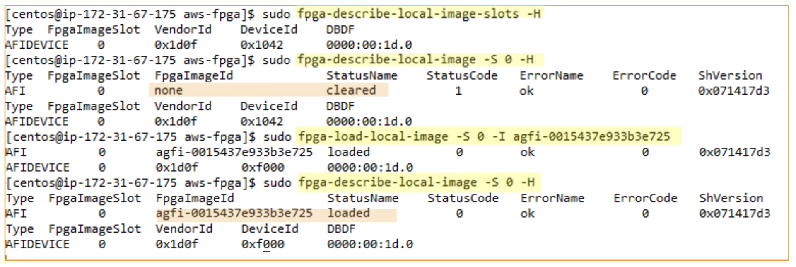
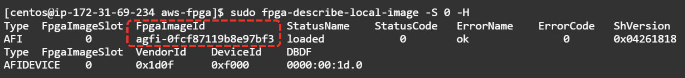

+++
title = "Amazon FPGA Image (AFI) Generation and Management Flow"
chapter = false
weight = 35
+++

- [AFI ID and AGFI ID]( "AFI ID and AGFI ID")
- [AWS CLI AFI Management Commands]( "AWS CLI AFI Management Commands")
- [Flow exercises for AFI generation]( "Flow exercises for AFI generation")
- [Amazon FPGA Image (AFI) Management Tool]( "Amazon FPGA Image (AFI) Management Tool")
- [Run Hello World sample]( "Run Hello World sample")

### AFI ID and AGFI ID

Amazon FPGA Image ID (AFI ID)
- Main ID for managing AFI with AWS CLI and SDK APIs
- **IDs vary by region**
- If the AFI is copied across regions, the AFI ID will be different for each region

Amazon Global FPGA Image ID (AGFI ID)
- Used to load or clear FPGA slots using FPGA management tools
- **AGFI’s are globally unique within the partition**. A partition is a grouping of AWS Regions. AWS currently has three partitions: aws (Standard Regions), aws-cn (China Regions), and aws-us-gov (AWS GovCloud [US] Regions), that will not have the same AGFI ID’s. Each partition will require a separate AFI creation.
- Because of the globally unique ID, you do not need to change AGFI IDs for each region when copying and using AFI/AMI across multiple regions

### AWS CLI AFI Management Commands

```bash
$ aws ec2 copy-fpga-image # Copies the specified AFI to the current region. create-fpga-image

$ aws ec2 create-fpga-image  # Creates an AFI from the specified design checkpoint (DCP) delete-fpga-image

$ aws ec2  delete-fpga-image # Deletes the specified AFI. describe-fpga-images

$ aws ec2  describe-fpga-images # Describes one or more available AFIs. These include public AFIs, private AFIs that you own, and AFIs owned by other AWS accounts for which you have load permissions.
 
$ aws ec2 describe-fpga-image-attribute # Describes the specified attribute of the specified AFI. modify-fpga-image-attribute

$ aws ec2  modify-fpga-image-attribute # Modifies the specified attribute of the specified AFI. reset-fpga-image-attribute

$ aws ec2  reset-fpga-image-attribute # Resets the specified attribute of the specified AFI to its default value. You can only reset the load permission attribute.
```

{}
Can be run on any instance other than f1. The AFI is specified by the AFI ID.
{}

#### Check available AFI

Check all accessible AFIs

```bash
$ aws ec2  describe-fpga-images
```

Confirm by Owner condition

```bash
$ aws ec2  describe-fpga-images --owners self

$ aws ec2  describe-fpga-images --owners amazon

$ aws ec2  describe-fpga-images --owners aws-marketplace
```

Check AFI status with a specific AFI ID

```bash
$ aws ec2  describe-fpga-images --fpga-image-ids afi-06d0ffc989feeea2a
```
{}
[github.com/aws/aws-fpga/blob/master/hdk/docs/describe_fpga_images.md](https://github.com/aws/aws-fpga/blob/master/hdk/docs/describe_fpga_images.md)
{}

#### Check AFI status with a specific AFI ID


#### Confirm AFI attribute change

Returns an AWS account that has access to the specified AFI

```bash
$ aws ec2 describe-fpga-image-attribute  \
          --fpga-image-id afi-xxxxxxxxxx \
          --attribute loadPermission
```

Give the designated AFI access to a specific AWS account

```bash
$ aws ec2 modify-fpga-image-attribute     \
          --fpga-image-id afi-xxxxxxxxxx  \
          --attribute loadPermission      \
          --load-permission Add==[{User Id=123456789012}]
```

Delete access rights granted to a specific AWS account from the specified AFI

```bash
$ aws ec2 reset-fpga-image-attribute     \
          --fpga-image-id afi-xxxxxxxxxx \
          --attribute loadPermission
```

{}
This command is useful when AFI developers and AFI users are using different AWS accounts
{}

### Flow exercises for AFI generation

1. Generate a bucket on S3 and upload the prebuilt file. *In the example below, a bucket named “my-unique-bucket-name-for-afi” is generated, a “dcp” folder is created in it, and a prebuilt file is uploaded.

{}
Please use a unique name for the S3 bucket you are creating. As S3 bucket names are globally unique, chances are an S3 bucket's name might be already in use. See [Bucket naming rules](https://docs.aws.amazon.com/AmazonS3/latest/userguide/bucketnamingrules.html) documentation for details.
{}

```bash
$ aws s3 mb s3://my-unique-bucket-name-for-afi —region us-east-1

$ aws s3 mb s3://my-unique-bucket-name-for-afi/dcp/

$ aws s3 cp $CL_DIR/build/checkpoints/to_aws/*.Developer_CL.tar s3://my-unique-bucket-name-fr-afi/dcp/
```

2. Prepare a “logs” folder to hold the logs in the “for-afi” bucket.

```bash
$ aws s3 mb s3://my-unique-bucket-name-for-afi/logs

$ touch LOG_FILES_GO_HERE.txt

$ aws s3 cp LOG_FILES_GO_HERE.txt s3://my-unique-bucket-name-for-afi/logs/
```

Slide 92. On the AWS console, it looks like this:

3. Use the AWS CLI AFI management command (create-fpga-image) to generate the AFI.

```bash
$ aws ec2 create-fpga-image  \
      --region us-east-1     \
      --name my-unique-bucket-name-my-afi \
      --description test-afi \
      --input-storage-location Bucket=for-afi,Key=dcp/19_03_18-101551.Developer_CL.tar \
      --logs-storage-location Bucket=for-afi,Key=logs
```

4. The create-FPGA-image command returns AFI-ID and AGFI-ID.


{}
https://docs.aws.amazon.com/cli/latest/reference/ec2/create-fpga-image.html
{}

5. Use the AWS CLI AFI management command (describe-fpga-images) to verify that the AFI generation is complete.

```bash
$ aws ec2 describe-fpga-images --fpga-image-ids afi-xxxxxxxxxxxx
{
    "FpgaImages" : [
        {
         ...
            "State" : {
                "Code": "pending" # AFI can be used when “Code” changes from “pending” to “available”
            },
         ...
        }
    ]
}
```

{}
https://docs.aws.amazon.com/cli/latest/reference/ec2/describe-fpga-images.html
{}

6. Since generating an AFI takes time, it is also possible to notify you by email when you're done.

```bash
$ cd ~/aws-fpga/shared/bin/scripts

$ ./wait_for_afi.py --afi afi-xxxxxxxxxxxx --notify --email email@example.com
```

**This script uses the AWS SNS function to send email notifications, so the account you are using must be authorized to generate SNS topic.**

{}
https://github.com/aws/aws-fpga/blob/master/hdk/docs/wait_for_afi.md
{}

### Amazon FPGA Image (AFI) Management Tool

Slide 96 Launch an F1 instance and load the AFI into the FPGA using AWS-provided AFI management tools




Amazon FPGA Image (AFI) Management Tool commands

```bash
$ fpga-describe-local-image-slots
# Returns the FPGA image slot numbers and device mappings

$ fpga-describe-local-image 
# Returns the status of the FPGA image for a specified FPGA image slot number. The fpga-image-slot parameter is an index that represents a given FPGA within an instance.

$ fpga-load-local-image 
# Loads the specified FPGA image to the specified slot number, and returns the status of the command. The fpga-image-slot parameter is an index that represents a given FPGA within an instance.

$ fpga-clear-local-image 
# Clears the specified FPGA image slot, including FPGA internal and external memories that are used by the slot. The fpga-image-slot parameter is an index that represents a given FPGA within an instance.

$ fpga-start-virtual-jtag 
# Starts a Virtual JTAG XVC server, to debug tools like Vivado Lab Edition Hardware Manager to access debug cores inside the AFI.

$ fpga-get-virtual-led 
# Returns a bit-map representating the state (1/0) the Virtual LEDs exposed by the Custom Logic (CL) part of the AFI.

$ fpga-get-virtual-dip-switch 
# Returns a bit-map representing the current setting for the Virtual DIP Switches that drives the Custom Logic (CL) part of the AFI.

$ fpga-set-virtual-dip-switch 
# Takes bit-map (in binary representation) to set for the Virtual DIP Switches that drives the Custom Logic (CL) part of the AFI.
```

{}
Run on the f1 instance. The AFI is specified by the AGFI ID.
{}

Install the AFI management tools to actually load the generated AFI into the FPGA

```bash
$ cd ~/aws-fpga

$ source sdk_setup.sh
```

Use the AFI management tool to determine which FPGA slots are available.

```bash
$ sudo fpga-describe-local-image-slots -H
```

{}
There is one FPGA slot available at f1.2xLarge
{}

Here we will load the pre-prepared AFI. Clear the slot, perform a load, and finally check the status of the FPGA slot.

```bash
$ sudo fpga-clear-local-image -S 0

$ sudo fpga-load-local-image -S 0 -l agfi-ofcf87119b8e97bf3

$ sudo fpga-describe-local-image -S 0 -H
```



### Run Hello World example

Build and run runtime software that runs on the host to run Hello World CL Example.

```bash
$ cd $cl_dir/software/runtime/

$ make all

$ sudo ./test_hello_world
```
In this test, 0xdeadBeaf is written to the hello_world register.


#### Virtual LED, Virtual DIP Switch

Verify that the Virtual LED reflects the lower 16 bits of the HELLO_WORLD register and that the Virtial DIP Switch is acting as a mask.

```bash
$ sudo fpga-set-virtual-dip-switch -S 0 -D 1111111111111111

$ sudo fpga-set-virtual-led -S 0
```


```bash
$ sudo fpga-set-virtual-dip-switch -S 0 -D 0000000000000000

$ sudo fpga-set-virtual-led -S 0
```


Verify that the Virtual LED reflects the lower 16 bits of the HELLO_WORLD register and that the Virtial DIP Switch is acting as a mask.

```bash
$ sudo fpga-set-virtual-dip-switch -S 0 -D 0000000000001111

$ sudo fpga-get-virtual-led -S 0
```


```bash
$ sudo fpga-set-virtual-dip-switch -S 0 -D 00000000111110000

$   sudo fpga-get-virtual-led -S 0
```


