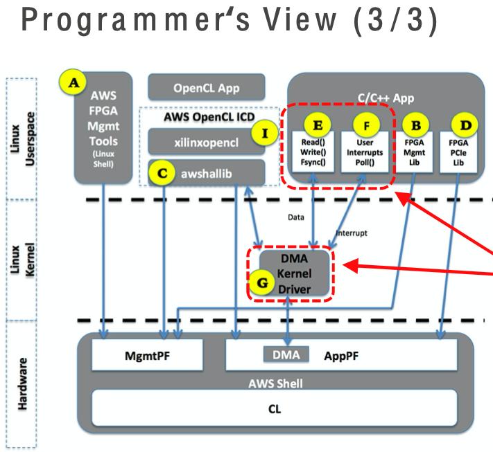

+++
title = "FPGA Shell specifications"
chapter = false
weight = 33
+++

- [Comparison of application development flow for F1]( "Comparison of application development flow for F1")
- [AWS Shell Specification Review]( "AWS Shell Specification Review")
- [FPGA PCIe interface]( "FPGA PCIe interface")
- [Application PF (appPF)]( "Application PF (appPF)")
- [Management PF (mgMTPF)]( "Management PF (mgMTPF)")
- [DMA_PCIS/PCIM interface]( "DMA_PCIS/PCIM interface")
- [Axi-Lite interface (SDA, OCL, BAR1)]( "Axi-Lite interface (SDA, OCL, BAR1)")
- [DDR4 interface (SDA, OCL, BAR1)]( "DDR4 interface (SDA, OCL, BAR1)")
- [Other interfaces]( "Other interfaces")
- [Programmers view]( "Programmers view")

### Comparison of application development flow for F1

Today's exercise focuses on the development flow through AWS HDK as shown in the column on the far right on bellow table:

| | Vitis / SDAccel | Vitis / SDAccel with RTL | **AWS HDK** |
|-|-----------------|--------------------------|---------|
| Development Environment | Vitis/SDAccel environment command line | Vitis/SDAccel environment command line | **Vivado shell script** |
| Accelerator (kernel) | OpenCL, C, C++ | RTL (Verilog/VHDL) | **RTL (Verilog/VHDL) or HLX (IP Integrator+HLS)** |
| FPGA API | OpenCL API | OpenCL API | **AWS SDK API** |
| Software emulation | Yes | N/A | **N/A** |
| Hardware emulation | Yes | Yes | **RTL simulation for accelerators only** |
| Performance profiling | Yes | Yes | **N/A** |

{}
See: https://github.com/aws/aws-fpga/blob/master/Vitis and https://github.com/aws/aws-fpga/blob/master/hdk for further reference
{}

{}
For the development flow by Vitis, please refer to “Reference Information Vitis Development Flow”
{}

### AWS Shell Specification Review

Understanding the AWS Shell specification is important when developing custom logic. After reviewing the AWS Shell specification, take sample code as an example to see the sequence of steps from build to execution.


{}
https://github.com/aws/aws-fpga/blob/master/hdk/docs/AWS_Shell_Interface_Specification.md
{}

### FPGA PCIe interface

The host and FPGA are connected with PCIe (x16 Gen3), and the PCIe interface to each FPGA consists of two physical functions (PF)

- Application PF (appPF)
    - used to access custom logic
- Management PF (mgMTPF)
    - Management of FPGA using FPGA management tools and libraries and use
- Virtual LED, Virtual DIP Switch, Virtual JTAG, AFI Management Tool, etc

Each PF consists of multiple PCIe base address registers (BAR). All PCIe BAR are mapped to the memory mapped I/O (MMIO) space on the EC2 instance.


### Application PF (appPF)

```bash
[centos @ip -172-31-76-63 ~] $ lspci -v -s 00:1d.0
00:1d.0 Memory controller: Amazon.com, Inc. Device f010
Subsystem:Device fedd:1d51
Physical Slot: 29
Flags: bus master, fast devsel, latency 0
Memory at 82000000 (32-bit, non-prefetchable) [size=32M]
Memory at 85400000 (32-bit, non-prefetchable) [size=2M]
Memory at 8560000 (64-bit, prefetchable) [size=64K]
Memory at 20000000000 (64-bit, prefetchable) [size=128G]
Capabilities: <access denied>
Kernel driver in use: xocl
Kernel modules: xocl
```

BAR0
- 32-bit BAR, non-prefetchable
- **32MiB** (0 to 0x1FFF-FFFF)
- Access via OCL AXI-L interface
- Access registers in custom logic and OpenCL
Used in kernels

BAR1
- 32-bit BAR, non-prefetchable
- **2MiB** (0 to 0x1F-FFFF)
- Access via BAR1 AXI-L interface
- Used to access registers in custom logic

BAR2
- 64-bit BAR, prefetchable
- 64KiB (0 to 0xFFFF)
- Used within AWS Shell. Not available in custom logic

BAR4
- 64-bit BAR, prefetchable
- **128GiB** (0 to 0x1F-FFFF)
- Access via the DMA_PCIS interface
- Used in DMA transactions

### Management PF (mgMTPF)

```bash
[centos @ip -172-31-76-63 ~] $ lspci -v -s 00:1e.0
00:1e.0 Memory controller: Amazon.com, Inc. Device 1041
    Subsystem: Xilink Corporation Device 0007
    Physical Slot: 30
    Flags: fast devsel
    Memory at 85618000 (64-bit, prefetchable) [size=16k]
    Memory at 8561c000 (64-bit, prefetchable) [size=16k]
    Memory at 85000000 (64-bit, prefetchable) [size=4m]
    Capabilities: <access denied>
```

BAR0
- 64-bit BAR, prefetchable
- 16KiB (0 to 0x3FFF)
- Available in AWS FPGA management tools
- Not available in custom logic

BAR2
- 64-bit BAR, prefetchable
- 16KiB (0 to 0x3FFF)
- Available in AWS FPGA management tools
- Not available in custom logic

BAR4
- 64-bit BAR, prefetchable
- 4MiB (0 to 0x3FFFF)
- Access via SDA AXI-L interface
- When to use the AWS OpenCL runtime library Used in performance monitors, etc.

### DMA_PCIS/PCIM interface

Both DMA_PCIS and PCIM interfaces consist of 512-bit wide AXI-4 interfaces. Used for data transfer where performance is required

##### DMA_PCIS interface
- Inbound PCIe transactions where SH is master and CL is slave
- Host access to appPF BAR4
- DMA Transactions (XDMA)

##### PCIM interface
- Outband PCIe where CL is master and sh is slave transactions
- Used to push data to memory on host or read data from host memory


### Axi-Lite interface (SDA, OCL, BAR1)

The Axi-Lite interface consists of 32 bits wide and is used for register access. Three interfaces available depending on the application

##### BAR1 interface
- Access to appPF BAR1
- Available with register access to CL
- OCL interface

##### Access to appPF BAR0
- If you want to use the AWS OpenCL runtime library is used in OpenCL kernel access
- SDA interface

##### Access to mgMTPF BAR4
- When using the AWS OpenCL runtime library, it is used in Performance Monitor, etc.


### DDR4 interface (SDA, OCL, BAR1)

Each FPGA card has four 16GB DIMMs each, and the internal logic and DDR4 memory controller are connected by 512-bit bus-width AXI-4 interfaces.

Of the four memory controllers, one is implemented on SH and the other three on CL. Therefore, there is an AXI-4 interface between SH-CL, where the CL is the master.


### Other interfaces

##### Interrupts
- 16 user interrupts available
- User interrupts mapped to MSI-X vectors

##### Virtual LED/DIP Switch
- Virtual LED and DIP Switch can be used to monitor and control CL respectively
- 16 LED, DIP Switches are available, accessible from the host through management software provided by AWS


### Programmers view

##### Management interface

Required for loading and clearing AFI, checking status, debugging, etc. The following three interfaces are available
- **(A)** FPGA management tool to call on Linux shell 
- **(B)** compiled with C/C++ application. FPGA management library
- **(C)** Pre-integrated OpenCL runtime library


{}
https://github.com/aws/aws-fpga/blob/master/hdk/docs/Programmer_View.md
{}

##### runtime code

Required for read, write access, interrupt processing, DMA access, etc., to CL (Custom Logic)

- **(D)** FPGA PCIe library is a library compiled and linked with C/C++ applications, such as access to register space and messaging, appPF PCIe Used to access FPGA memory space through BAR
- **(I)** OpenCL ICD library linked to the OpenCL run-time application generated by vitis/sdAccel, etc.


Required for read, write access, interrupt processing, DMA access, etc., to CL (Custom Logic)

- **(E)** By installing the XDMA kernel driver **[G]**, you can use standard POSIX APIs such as open () /read () /write () from your C/C++ application Use to perform data transfer using DMA
- **(F)** By installing the XDMA kernel driver **[G]**, you can use standard POSIX APIs, such as open () /poll () from your C/C++ application, and use the user space Performs interrupt/event communication


