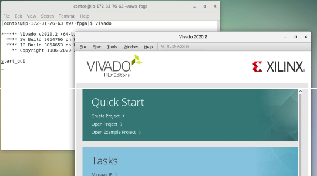
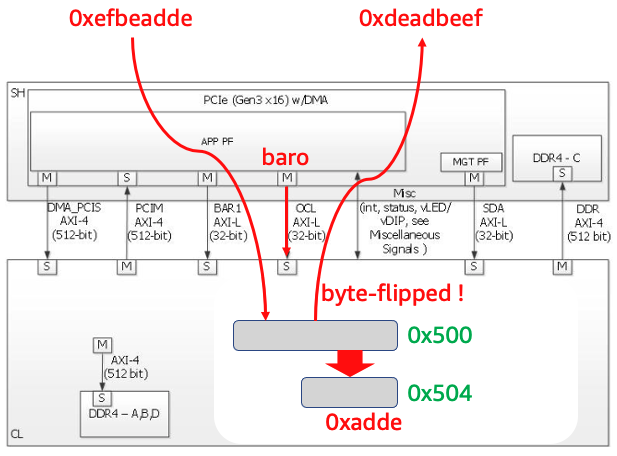

+++
title = "HDK development flow"
chapter = false
weight = 34
+++

- [Setting up the HDK development environment]( "Setting up the HDK development environment")
- [Review Hello World samples and review related files]( "Review Hello World samples and review related files")
- [HDK development flow exercises]( "HDK development flow exercises")

### Setting up the HDK development environment

On the instance you just created, run the following command to perform the initial configuration:

1. Download the aws-fpga repository under /home/centos/, which is an HDK &SDK environment.

```bash
$ git clone https://github.com/aws/aws-fpga.git ~/aws-fpga
```

2. Next, follow these steps to set preferences for HDK use:

```bash
$ cd ~/aws-fpga

$ source hdk_setup.sh
```

{}
You need to start hdk_setup.sh every time you open a new terminal
{}

In the GUI environment, let's make sure that vivado is up

```bash
$ vivado
```



{}
In this exercise, it is not mandatory to use the GUI environment. You can proceed in either CUI or GUI environment.
{}

### Review the Hello World sample

Various sample code is installed through setting up the HDK development environment.

We recommend that you start the development of your own custom logic and host application software by copying the sample code with reference to the sample code.

In this hands-on, you will learn how to implement Hello World sample code (called L-Chica) on an F1 instance and experience a series of steps from build to execution.

```bash
$ echo $HDK_DIR

$ cd $HDK_DIR/cl/examples/cl_hello_world
```

https://github.com/aws/aws-fpga/tree/master/hdk/cl/examples/cl_hello_world


#### Practice accessing basic memory-mapped registers

This sample accesses two registers connected to the OCL AXI-L interface in the appPF BAR0 memory space. It also uses the Virtual LED and Virtual DIP Switch.

Hello World Register (offset 0x500):
- 32-bit read/write register

Virtual LED Register (offset 0x504):
- 16-bit lead-only register
- Reflects the lower 16 bits of Hello World Register



#### List of related files

Check the contents of **cl_hello_world.sv** and **test_hello_world.c**

```bash
~/aws-fpga/hdk($HDK_DIR)
|---- cl
    |---- developer_designs # Your own CL is developed here. It is recommended to copy the following designs and start developing.
    |
    |---- examples
       |
       |---- cl_hello_world ($CL_DIR)
          |
          |---- build
          |
          |---- design # Custom logic executed on FPGA
          |   |---- cl_hello_world_defines.vh
          |   |---- cl_hello_world.sv
          |   |---- cl_id_defines.vh
          |
          |---- software 
          |   |---- runtime # Runtime that runs on the host
          |   |   |---- Makefile
          |   |   |---- test_hello_world.c
          |   |
          |   |---- verif_rtl
          |
          |---- verif
```

Now, check the contents of **cl_ports.vh**

```bash
~/aws-fpga/hdk($HDK_DIR)
|---- cl
|   |---- developer_designs # Your own CL is developed here. It is recommended to copy the following designs and start developing.
|   |
|   |---- examples
|
|---- common
    |---- shell_stable ($HDK_SHELL_DIR) # Shell running on FPGA
    |   |---- design
    |      |---- interfaces
    |         |---- cl_ports.vh
    |
    |---- software
```

#### hello world source code

**test_hello_world.c** (host application code)

```c
#define HELLO_WORLD_REG_ADDR UINT64_C(0x500)
#define VLED_REG_ADDR UINT64_C(0x504)

int main(int argc, char **argv)
{
   uint32_t value = 0xefbeadde;
   rc = fpga_mgmt_init();
   rc = check_afi_ready(slot_id);
   rc = peek_poke_example(value, slot_id, FPGA_APP_PF, APP_PF_BAR0);
}

int peek_poke_example(uint32_t value, int slot_id, int pf_id, int bar_id) {
   pci_bar_handle_t pci_bar_handle = PCI_BAR_HANDLE_INIT;
   rc = fpga_pci_attach(slot_id, pf_id, bar_id, 0, &pci_bar_handle);
   uint32_t expected = byte_swap(value);
   rc = fpga_pci_poke(pci_bar_handle, HELLO_WORLD_REG_ADDR, value);
   rc = fpga_pci_peek(pci_bar_handle, HELLO_WORLD_REG_ADDR, &value);

if(value == expected) {
   printf("TEST PASSED");
```

{}
Excerpt code for reviewing content. The actual code contents refer to the real file
{}

**cl_hello_world.sv** (FPGA kernel code)

```
//-------------------------------------------------
// Wires
//-------------------------------------------------
  logic        arvalid_q;
  logic [31:0] araddr_q;
  logic [31:0] hello_world_q_byte_swapped;
  logic [15:0] vled_q;
  logic [15:0] pre_cl_sh_status_vled;
  logic [15:0] sh_cl_status_vdip_q;
  logic [15:0] sh_cl_status_vdip_q2;
  logic [31:0] hello_world_q;
...
//--------------------------------------------------------------
// PCIe OCL AXI-L Slave Accesses (accesses from PCIe AppPF BAR0)
//--------------------------------------------------------------
// Only supports single-beat accesses.

   logic        awvalid;
   logic [31:0] awaddr;
   logic        wvalid;
...
//-------------------------------------------------
// Hello World Register
//-------------------------------------------------
// When read it, returns the byte-flipped value.

always_ff @(posedge clk_main_a0)
   if (!rst_main_n_sync) begin                    // Reset
      hello_world_q[31:0] <= 32'h0000_0000;
   end
   else if (wready & (wr_addr == `HELLO_WORLD_REG_ADDR)) begin  
      hello_world_q[31:0] <= wdata[31:0];
   end
   else begin                                // Hold Value
      hello_world_q[31:0] <= hello_world_q[31:0];
   end

assign hello_world_q_byte_swapped[31:0] = {hello_world_q[7:0],   hello_world_q[15:8],
                                           hello_world_q[23:16], hello_world_q[31:24]};
```

{}
Excerpt code for reviewing content The actual code contents refer to the real file
{}

**cl_ports.vh** (FPGA kernel code)

```
...
51 output logic[31:0] cl_sh_id1,                //15:0 - PCI Subsystem Vendor ID
52                                              //31:16 - PCI Subsystem ID
53
54 input[31:0] sh_cl_ctl0,                      //Functionality TBD
55 input[31:0] sh_cl_ctl1,                      //Functionality TBD
56
57 input[15:0] sh_cl_status_vdip,               //Virtual DIP switches.  Controlled through FPGA management PF and tools.
58 output logic[15:0] cl_sh_status_vled,        //Virtual LEDs, monitored through FPGA management PF and tools
...
68  //-------------------------------------------------------------------------------------------
69  // PCIe Master interface from CL
70  //
71  //    AXI-4 master interface per PCIe interface.  This is for PCIe transactions mastered
72  //    from the SH targetting the host (DMA access to host).  Standard AXI-4 interface.
73  //-------------------------------------------------------------------------------------------
74  output logic[15:0] cl_sh_pcim_awid,
75  output logic[63:0] cl_sh_pcim_awaddr,
76  output logic[7:0] cl_sh_pcim_awlen,
77  output logic[2:0] cl_sh_pcim_awsize,
```

- line 57: Can be accessed using FPGA management tool In this sample code, it is defined as a function to mask the signal from the Virtual LED register
- line 58: In this sample code, defined as a signal from a register that reflects the lower 16 bits of Hello World Register

### List of related files

```bash
~/aws-fpga/hdk/cl/examples/cl_hello_world ($CL_DIR)
|
|---- build
|   |---- checkpoint
|   |    |---- to_aws  # Here the files needed to generate the AFI are generated
|   |
|   |---- constrains # Timing, clock, and placement constraints are described here
|   |---- reports
|   |---- script
|   |   |---- aws_build_dcp_from_cl.sh # script to run to create a dcp file
|   |   |---- create_dcp_from_cl.tcl
|   |   |---- encrypt.tcl
|   |
|   |---- reports
|   |---- src_post_encryption # Encrypted files are placed here
```
{}
Check the contents of **aws_build_dcp_from_cl.sh**
{}

#### Files required for HDK development

- Run `aws_build_dcp_from_cl.sh` to run a series of flows up to generating a Design CheckPoint (dcp) file.

- For proper execution, the following conditions must be met:
    - `$HDK_SHELL_DIR` and `$CL_DIR` are set correctly
    - `$CL_DIR` must have a `/build` subdirectory
    - The `/build` directory has the following subdirectories `/constraints`, `/scripts`, `/src_post_encryption`, `/reports`, `checkpoints/to_aws`
    - `$cl_dir/build/script/encrypt.tcl` is updated according to design. Include all source files
        - Source files containing header files are encrypted and placed under `src_post_encryption`
    - Updated timing restrictions etc. according to design in the `$cl_dir/build/constraints` directory
    - Updated `$cl_dir/build/scripts/create_dcp_from_cl.tcl` according to design. Update IP sources, xDC files, and design-specific xdc files

### HDK Development Flow Exercise

Follow this steps to develop using HDK.

1. Run aws_build_dcp_from_cl.sh to start vivado in batch mode and generate a Design CheckPoint (dcp) file Run the flow.

```bash
$ cd $HDK_DIR/cl/examples/cl_hello_world

$ export CL_DIR=$(pwd)

$ cd $CL_DIR/build/scripts

$ ./aws_build_dcp_from_cl.sh -foreground # By default, the build process runs in the background
```

2. Since the series of build work takes several hours, we'll finish it with Ctrl-C here. You can also run your build work in the background and notify you by email when it's done.

```bash
$ export AWS_DEFAULT_REGION=<the region you are working in, i.e. "us-east-1" / "eu-west-1">

$ sudo pip3 install boto3 # if pip3 is missing you will get an error, to fix run `$ sudo yum install python3-pip -y` first

$ export EMAIL=your.email@example.com

$ python3 $AWS_FPGA_REPO_DIR/shared/bin/scripts/notify_via_sns.py

$ ./aws_build_dcp_from_cl.sh -notify
```

3. Once the build is complete, the .tar file will be generated under build/checkpoints/to_aws/.


Since the series of build work takes about 1.5 hours, we download the pre-built file `19_03_18-101551.Developer_CL.tar` and proceed to the subsequent AFI generation flow.

```bash
$ cd $CL_DIR/build/checkpoints/to_aws/

$ curl -O https://s3-ap-northeast-1.amazonaws.com/ogapub/handson/F1/19_03_18-101551.Developer_CL.tar
```


