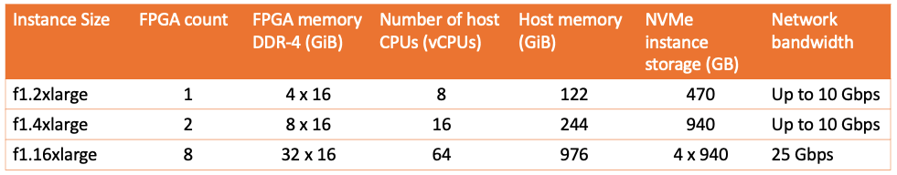
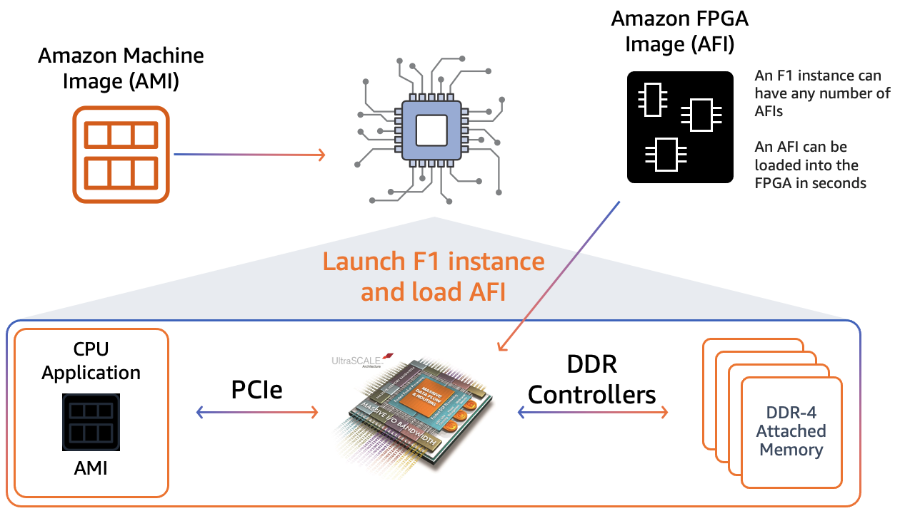
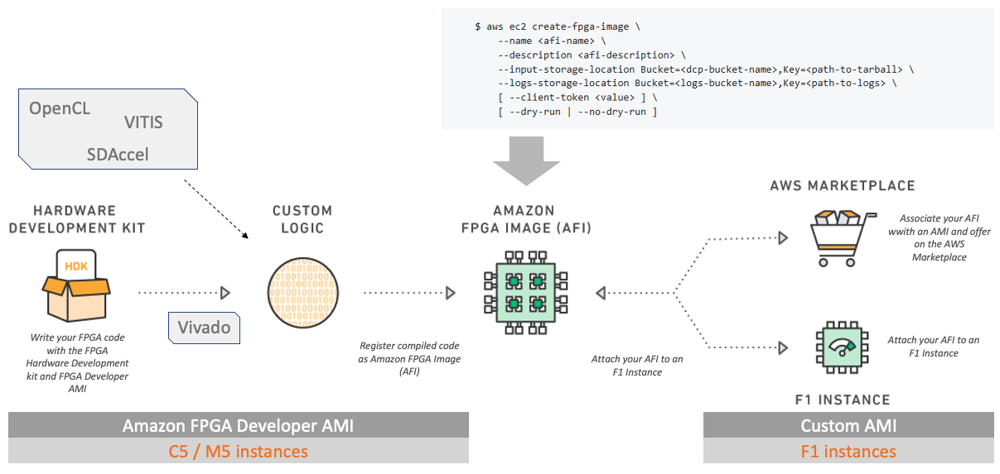
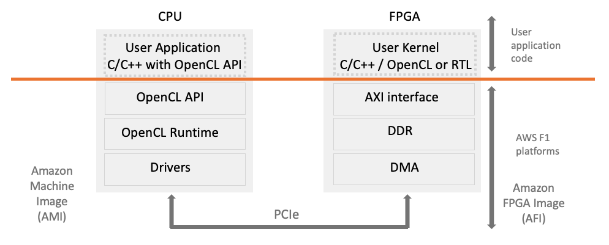
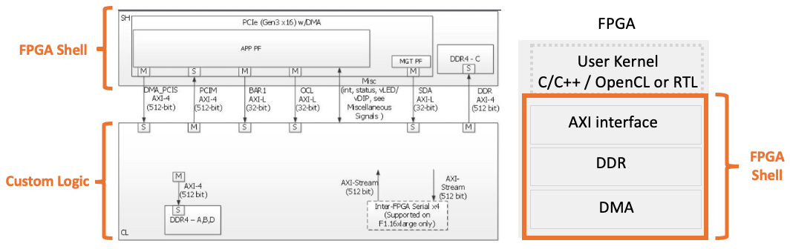

+++
title = "Introduction of F1 development environment"
chapter = false
weight = 32
+++

- [What is an FPGA]( "What is an FPGA")
- [Amazon EC2 F1 FPGA instance family]( "Amazon EC2 F1 FPGA instance family")
- [How FPGA Acceleration Works Using EC2 F1]( "How FPGA Acceleration Works Using EC2 F1")
- [FPGA Developer AMI]( "FPGA Developer AMI")
- [Application Development Environment for F1]( "Application Development Environment for F1")
- [HDK/SDK, Xilinx development environment, AMI version dependencies]( "HDK/SDK, Xilinx development environment, AMI version dependencies")
- [Application development flow on EC2 F1]( "Application development flow on EC2 F1")
- [AWS F1 platform model]( "AWS F1 platform model")
- [F1 FPGA Shell: FPGA I/O abstraction]( "F1 FPGA Shell: FPGA I/O abstraction")
- [Generate kernel from C/C++, OpenCL, RTL]( "Generate kernel from C/C++, OpenCL, RTL")
- [Amazon FPGA Image (AFI)]( "Amazon FPGA Image (AFI)")

### What is an FPGA

**Field Programable Gate Arrays** are reprogrammable hardware devices that can implement any logic function. This makes FPGAs similar to custom silicon (aka Application-Specific Integrated Circuits, or ASICs), allowing developers to create custom processors/accelerators that provide optimized compute tailored to accelerate a specific workload. This enables in specific cases a significant acceleration compared to fixed-function compute solutions like CPUs and GPUs.

Challenges for development and environment maintenance...

- Initial cost for the introduction of FPGA board

- Setup of FPGA development/test environment

- System deployment, maintenance, operation after development etc.

F1 instances that provide FPGAs in the cloud solve the challenge!

{}
Unlike showed in above diagramm, the F1 instance does not offer FPGA to FPGA links!
{}

### Amazon EC2 F1 FPGA instance family

[F1 instances](https://aws.amazon.com/ec2/instance-types/f1/) offer customizable hardware acceleration with field programmable gate arrays (FPGAs).

Instances Features:
- High frequency Intel Xeon E5-2686 v4 (Broadwell) processors
- NVMe SSD Storage
- Support for Enhanced Networking
- Up to 8 Xilinx UltraCale+ 16nm VU9P FPGAs per Instance
- Launch in minutes and available for hourly or per-second pay-as-you-go
- The f1.16xlarge has
    - 8 FPGAs, each FPGA has more than 2 million logic cells and 5000+ DSP blocks
    - Each FPGA has four DDR-4 memory interfaces, each interface is 72bit wide and has access to 16GiB ECC protected memory

FPGA Features:
- Xilinx Virtex UltraScale+ VU9P FPGAs
- 64 GiB of ECC-protected memory on 4x DDR4
- Dedicated PCI-Express x16 interface
- Approximately 2.5 million logic elements
- Approximately 6,800 Digital Signal Processing (DSP) engines
- [FPGA Developer AMI](https://aws.amazon.com/marketplace/pp/B06VVYBLZZ)

### How FPGA Acceleration Works Using EC2 F1

F1 FPGA Acceleration Process Flow
1. Deploy an AMI (OS image) to an F1 instance to launch the OS
2. Load AFI (FPGA Image) into FPGA using API from OS
3. Run the host application on the OS and process it on the FPGA

### FPGA Developer AMI

- OS image in which FPGA development environment has been introduced, allowing you to start development work instantly
- Xilinx Vivado installed
- Debugging, profiling, and performance analysis
- Integrate tools
- Use of AMI is at no extra cost. It also works on generic instances such as C5, so it can be used inexpensively for initial processes where no hardware is required (target devices are limited to F1)
https://aws.amazon.com/marketplace/pp/B06VVYBLZZ

Xilinx Vivado custom logic development environment

{}
If you want to develop devices other than F1, Xilinx also provides Vivado Developer AMI's (license fee is charged hourly) and Vitis Developer AMI's (free)
{}

### Application Development Environment for F1 (GitHub)

AWS FPGA GitHub contains all the drivers, code, examples, and tutorials needed to develop hardware acceleration for the AWS FPGAs

https://github.com/aws/aws-fpga

Hardware Development Kit (HDK)
- FPGA Shell components required to build Amazon FPGA Image (AFI)
- HDK can run on all instances
- More than 80 different F1 sample codes available. Security, image processing, algorithm acceleration, etc.

Software Development Kit (SDK)
- A software interface that runs on F1 instances for managing FPGAs

{}
 By separating HDK and SDK from FPGA Developer AMI, you can install HDK under on-pre development environment and develop for F1 instances. In addition, F1 instances are available only in the SDK during actual operation.
{}

### HDK/SDK, Xilinx development environment, AMI version dependencies

AWS marketplace offers multiple versions of the FPGA Developer AMI. The following compatibility table describes the mapping of currently supported developer kit versions to AMI versions:

| Developer Kit Version | Tool Version Supported | Compatible FPGA Developer AMI Version |
|-----------|-----------|------|
| 1.4.18+ | 2020.2 | v1.10.X (Xilinx Vivado/Vitis 2020.2) |
| 1.4.16+ | 2020.1 | v1.9.0-v1.9.X (Xilinx Vivado/Vitis 2020.1) |
| 1.4.13+ | 2019.2 | v1.8.0-v1.8.X (Xilinx Vivado/Vitis 2019.2) |
| 1.4.11+ | 2019.1 | v1.7.0-v1.7.X (Xilinx Vivado/SDx 2019.1) |

{}
⚠️ Developer kit release v1.4.16 will remove support for Xilinx 2017.4, 2018.2, 2018.3 toolsets. 
While developer kit release v1.4.16 onwards will not support older Xilinx tools, you can still use them using HDK releases v1.4.15a or earlier. 
Please checkout [the latest v1.4.15a release tag from Github](https://github.com/aws/aws-fpga/releases/tag/v1.4.15a) to use Xilinx 2017.4, 2018.2, 2018.3 toolsets.
{}

{}
⚠️ Developer kit versions prior to v1.3.7 and Developer AMI prior to v1.4 (2017.1) reached end-of-life. See [AWS forum announcement](https://forums.aws.amazon.com/ann.jspa?annID=6068) for additional details.
{}

###  Application development flow on EC2 F1

### AWS F1 platform model

Both host (CPU) and device (FPGA) are available on AWS side, so users can focus on developing applications.

### F1 FPGA Shell: FPGA I/O abstraction

F1 FPGA Shell is a pre-defined and validated secure I/O component and hardware health monitor so developers can focus on developing their own acceleration logic Ring function available

Easy to use and optimized for performance

### Generate kernel from C/C++, OpenCL, RTL 

Vitis compiler uses OpenCL, C, C++ to generate kernel (.xo) generating

Highly optimized for FPGA devices
- Memory partitioning
- Inference of DSP blocks
- Unrolling loops, pipelining loops

Compiler assembles FPGA design
- Instantiate the kernel and F1 shell
- Generate DDR interfaces and interconnect logic and all other connections you need

Perform logic synthesis and placement wiring on assembled FPGA designs

Generate FPGA binaries (.xclbin) to perform logic synthesis and placement wiring on assembled FPGA designs

### Amazon FPGA Image (AFI)

- xclbin is encrypted Amazon FPGA Converted to Image (AFI)
- The generated AFI is securely stored by the AWS EC2 backend service
- The distributable awsxclbin only holds the afi id
- The AFI id is used at runtime when downloading the AFI from a secure location to the FPGA
- Application developers do not have access to accelerated RTL IPs

