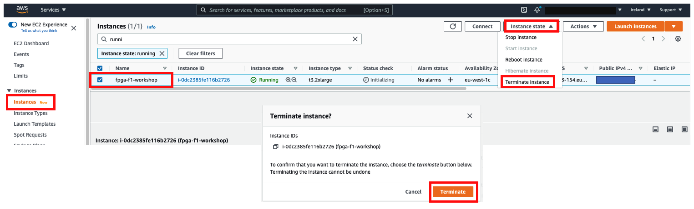
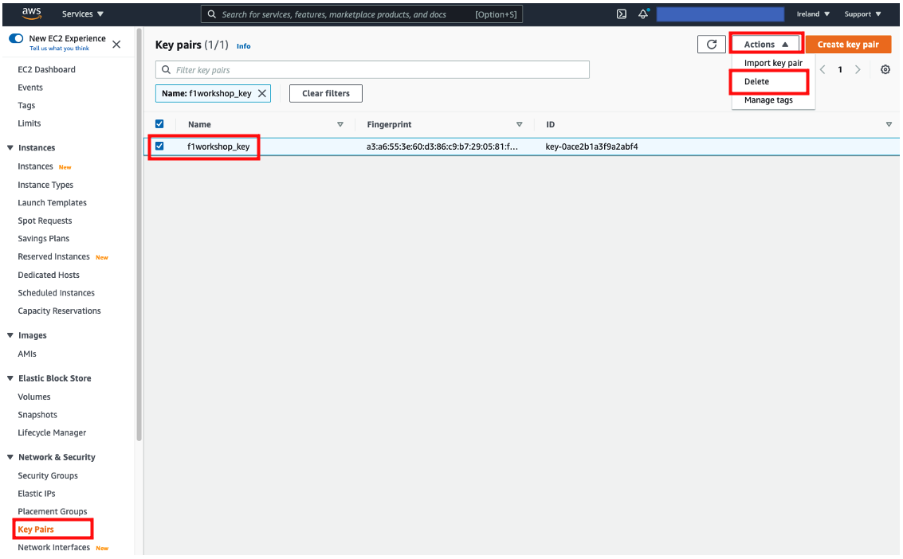
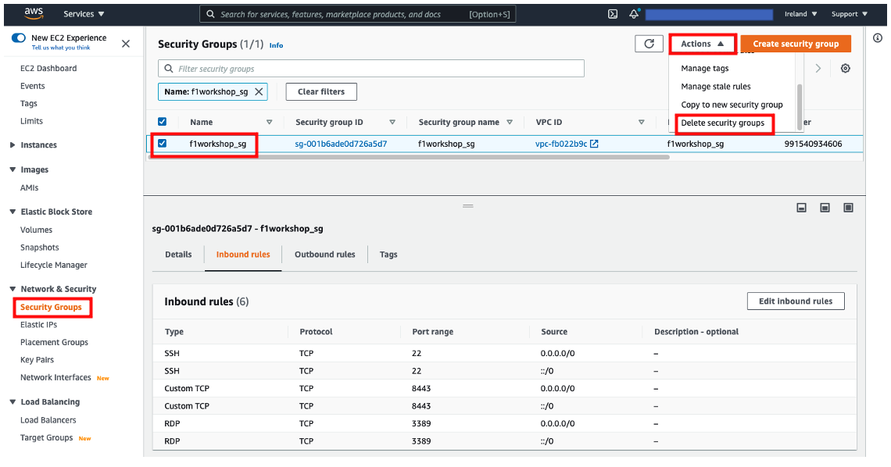

+++
title = "Teardown the lab environment"
chapter = false
weight = 39
+++

- [Clean up 1: S3 bucket and delete files]( "Clean up 1: S3 bucket and delete files")
- [Clean up 2: Instance Termination]( "Clean up 2: Instance Termination")
- [Clean up 3: Delete key pair]( "Clean up 3: Delete key pair")
- [Clean up 4: Delete Security Group]( "Clean up 4: Delete Security Group")

### Clean up 1: S3 bucket and delete files
SSH into the F1 instance and delete the S3 bucket and the underlying files with the command below

{}
Below is an example of deleting an S3 bucket named “guestxx-yyyymmdd”. Please specify the S3 bucket name you created and delete it. If you delete it here, you will not be able to recover deleted data, so please be careful.
{}

```bash
$ aws s3 ls # Display/Verify S3 Buckets List
$ aws s3 rb s3://guestxx-yyyymmdd --force # Force Delete S3 Buckets and Underlying Files
```

### Clean up 2: Instance Termination
Select the instance you created from the EC2 admin screen, and select “Instance Status” → “Terminate Instance” from the Actions menu

If a screen indicating successful completion is output, it is complete.

{}
This delete operation will also delete the instance and storage and will not be charged
{}



### Clean up 3: Delete key pair
- Select your own key pair from the Key Pair screen
- Choose ActionsDelete from the actions menu
- Delete the private key you downloaded when you created the key pair on your PC



### Clean up 4: Delete security group
- Select your own security group from the Security Groups screen 
- Choose Actions > Delete Security Group from the actions menu



