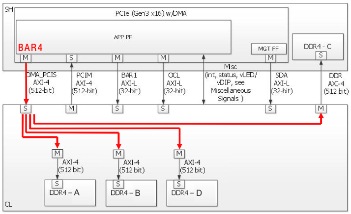
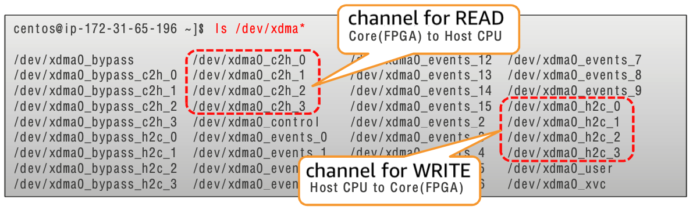
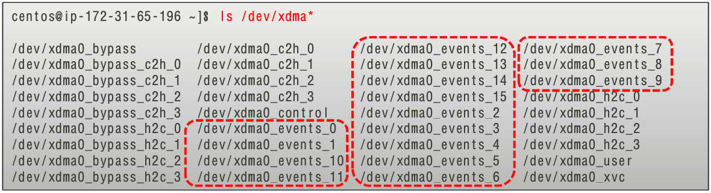
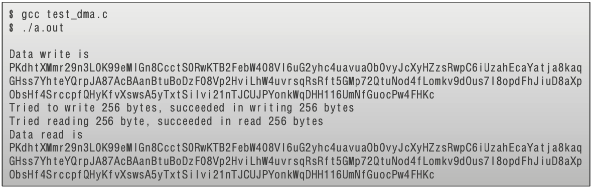

+++
title = "XDMA to transfer data between hosts and FPGAs"
chapter = false
weight = 36
+++

- [Install the XDMA driver]( "Install the XDMA driver")
- [Setting up the XDMA engine]( "Setting up the XDMA engine")
- [AFI Configuration Overview]( "AFI Configuration Overview")
- [Confirmation of setup]( "Confirmation of setup")
- [Run XDMA sample code]( "Run XDMA sample code")
- [About host—FPGA performance]( "About host—FPGA performance")

AWS FPGA HDK/SDK provides host memory, XDMA engine on FPGA Shell for data transfer between FPGA memory, and XDMA driver that runs on the host it's

##### XDMA driver
- Open source
- Multichannel interface
- Perform data transfer using DMA from the application using standard POSIX APIs such as open () /read () /write ()
- Use standard POSIX APIs such as open () /poll () from your application to perform user space interrupt/event notifications

{}
https://github.com/aws/aws-fpga/tree/master/sdk/linux_kernel_drivers/xdma
{}

### Install the XDMA driver

Follow these steps to install the XDMA driver:

```bash
$ sudo systemctl stop mpd

$ sudo yum remove -y xrt xrt-aws # Environment (XRT). Remove XOCL driver

$ cd ~/aws-fpga/sdk/linux_kernel_drivers/xdma

$ make

$ sudo make install

$ lsmod | grep xdma # Verify that the XDMA driver is installed
```

{}
https://github.com/aws/aws-fpga/blob/master/sdk/linux_kernel_drivers/xdma/xdma_install.md
{}

### Setting up the XDMA engine

Here we will load the pre-prepared AFI. Clear the slot, then perform the load and finally check the status of the FPGA slot

```bash
$ sudo fpga-clear-local-image -S 0

$ sudo fpga-load-local-image -S 0 -I agfi-0b5c35827af676702

$ sudo fpga-describe-local-image -S 0 -H
```

{}
For more information about the contents of AFI, please refer to the following link: https://github.com/aws/aws-fpga/tree/master/hdk/cl/examples/cl_dram_dma
{}

### AFI Configuration Overview

In this AFI, four DRAM channels are mapped over the appPF BAR4 memory space via the DMA_PCIS interface.

```bash
DDR_A (base_addr=0x0_0000_0000, 16GB)
DDR_B (base_addr=0x4_0000_0000, 16GB)
DDR_C (base_addr=0x8_0000_0000, 16GB)
DDR_D (base_addr=0xC_0000_0000, 16GB)
```



### Confirmation of setup

- Once XDMA setup is complete, the available XDMA appears on /dev/ as a device file.
- You can see that there are 4 channels of READ and WRITE.



{}
https://github.com/aws/aws-fpga/tree/master/sdk/linux_kernel_drivers/xdma
{}

- XDMA driver also supports interrupt/event notification.
- Interrupts are reported as mSI-X interrupts to PCIe apppf.



{}
https://github.com/aws/aws-fpga/blob/master/sdk/linux_kernel_drivers/xdma/user_defined_interrupts_README.md
{}

### Run XDMA sample code
- Run the sample code in the link below
- Save the sample code under the file name test_dma.c and run it.



{}
https://github.com/aws/aws-fpga/tree/master/sdk/linux_kernel_drivers/xdma
{}

##### XDMA sample code

test_dma.c (host application code 1/4)

```c
#include <stdlib.h>
#include <stdio.h>
#include <fcntl.h>
#include <errno.h>
#include <unistd.h>

#define BUF_SIZE 256
#define OFFSET_IN_FPGA_DRAM 0x10000000

static char *rand_str (char *str, size_t size)//randomize a string of size <size> //Lunders of the specified size, Generate a mad string
{
    const char charset [] = "abcdefghijklmnopqrstuvxyzuvxyzabcdefhijklmnopqlmnopqlmnopqrtSUVXYZ1234567890";
    int i;
        
    for (i = 0; i < size; i++) {
        int key = rand ()% (int) (sizeof charset - 1);
        str [i] = charset [key];

    }
    str [size-1] = '\ 0';
    return str;
}
```

test_dma.c (host application code 2/4)

- on host memory
- Secure buffer
- Show generated data, Add to linked code
- Host Memory → Open DMA Channel for WRITE to FPGA Memory

```c
int main () {
    char* srcBuF;
    char* dstBuf;
    int read_fd;
    int write_fd;
    int i;
    int ret;

on host memory
Secure buffer

srcBUF = (char*) malloc (buf_size* sizeof (char)); // on host memory
                                                   // Secure buffer
dstBuf = (char*) malloc (buf_size* sizeof (char));

/* Initialize srcBuF */
rand_str (srcBUF, BUF_SIZE);

printf ("Data write is%s\ n", srcBuF); // Show generated data*Add to linked code

/* Open a XDMA write channel (Host to Core) */
if ((write_fd = open ("/dev/xdma0_h2c_0", O_WRONLY)) == -1) { // Host Memory → Open DMA Channel for WRITE to FPGA Memory
    perror ("open failed with errno");
 }

```

test_dma.c (host application code 3/4)

- Open DMA channel for READ from FPGA memory to host memory
- Transfers random string data prepared on host memory to FPGA memory
- Data written to FPGA memory is transferred to host memory

```c
 /* Open a XDMA read channel (Core to Host) */
if (read_fd = open ("/dev/xdma0_c2h_0", O_RDONLY)) == -1) { // Open DMA channel for READ from FPGA memory to host memory
    perror ("open failed with errno");
}

/* Write the ENTIRE source buffer to offset OFFSET_IN_FPGA_DRAM */
ret = pwrite (write_fd, srcBUF, BUF_SIZE, OFFSET_IN_FPGA_DRAM); // Transfers random string data prepared on host memory to FPGA memory
    if (ret < 0) {
    perror ("write failed with errno");
    }

printf ("Tried to write %u bytes, succeeded in writing%u bytes\n", BUF_SIZE, ret);

ret = read (read_fd, dstBUF, BUF_SIZE, OFFSET_IN_FPGA_DRAM); // Data written to FPGA memory is transferred to host memory
if (ret < 0) {
perror ("read failed with errn");
}
printf ("Tried reading%u byte, succeeded in read%u bytes\ n", BUF_SIZE, ret);
```

test_dma.c (host application code 4/4)

- Displays data transferred from FPGA memory to host memory

```c
if (close (write_fd) < 0) {
perror ("write_fd close failed with errno");
}
if (close (read_fd) < 0) {
perror ("read_fd close failed with errno");
}
printf ("Data read is%s\ n", dstBuF); // Displays data transferred from FPGA memory to host memory
return 0;
```

### About host—FPGA performance

- Host and FPGA connected via PCIe x16, Gen3
    - Due to PCIe specifications, effective transfer rates at the data link layer are **15.75Gb/sec one-way**, bi-directional
Direction 31.5Gb/sec

- XDMA performance
    - HDK/SDK provides XDMA engine on shell and XDMA runtime driver that runs on the host
    - **READ 12.8Gb/s, WRITE 11.5Gb/s**
    - FIO Benchmarking Techniques for DMA

{}
https://github.com/aws/aws-fpga/tree/master/sdk/tests/fio_dma_tools
{}
