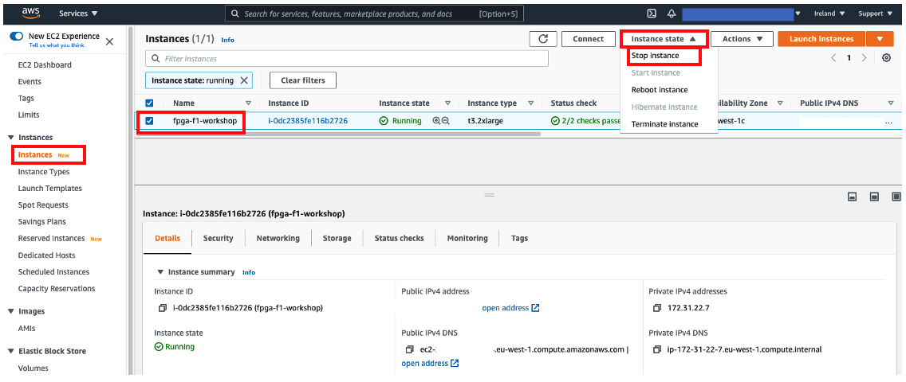
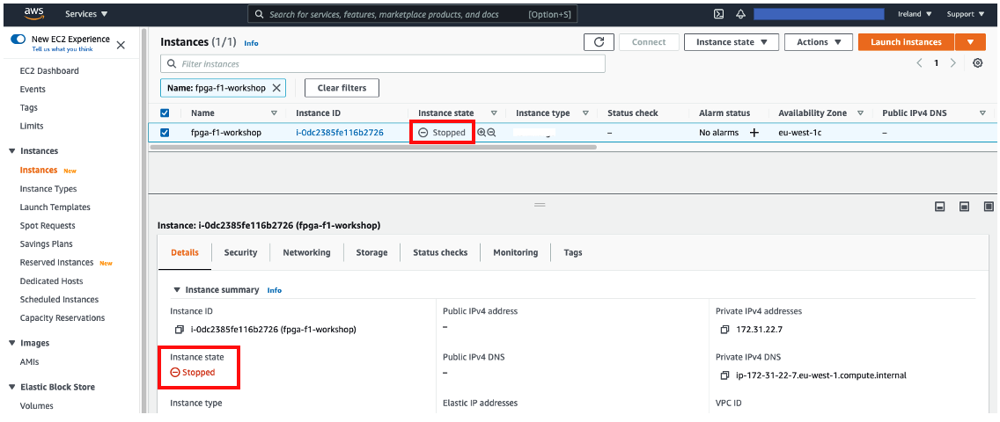
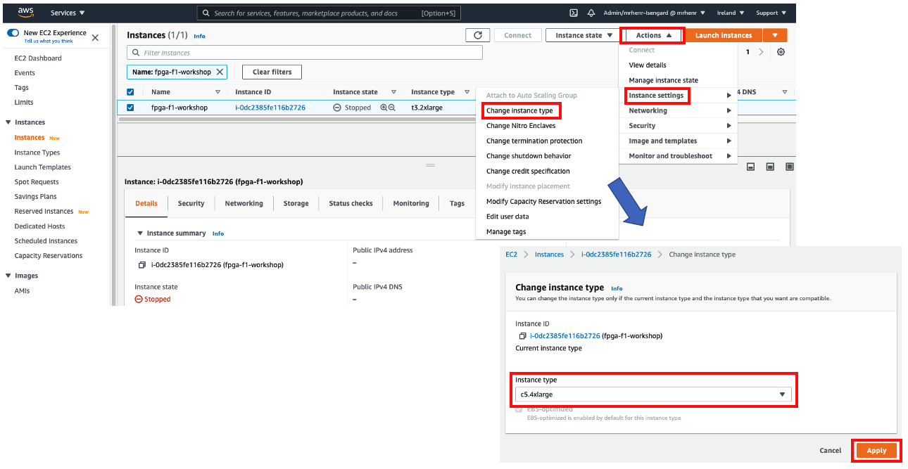
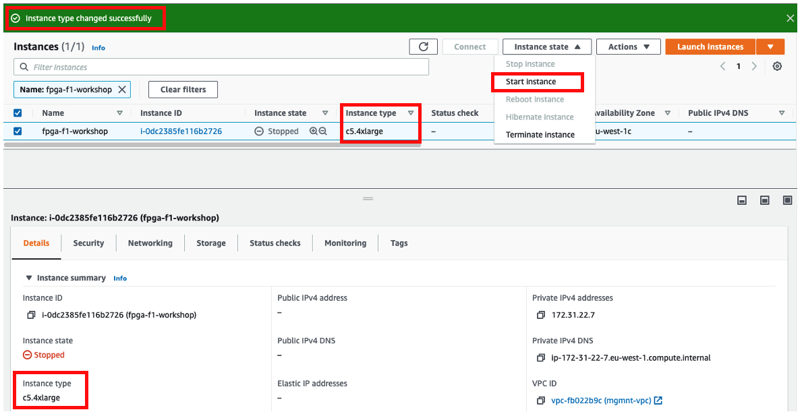

+++
title = "Change the EC2 instance type"
chapter = false
weight = 69
+++

You can change the instance type at any time by stopping the instance. To change the instance type, follow these steps:
1. Stop the instance you want to modify (no action is required if it is already stopped)
1. Verify that the instance state has changed to Stopped

1. Choose Actions > Configure Instance > Change Instance Type
1. Select the instance type you want to modify from the instance type drop-down menu (“c5.2xlarge” in the example) and click the Apply button
1. Verify that the instance has changed to the one you specified

1. Select your modified instance and select Start Instance (in Actions dropdown)
1. After some time after starting, you will see the public DNS entry (or public IP) for ssh or remote desktop login (centos user)

