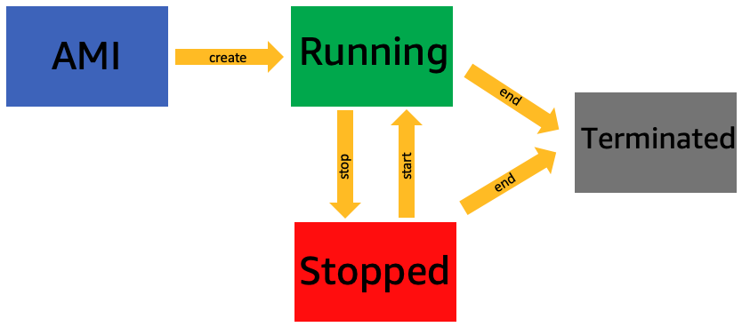

+++
title = "EC2 Instance Lifecycle"
chapter = false
weight = 66
+++

The instance you launched has three states
- Running: While running, you will be charged. Transition to Stopped in a stop process.
- Stopped: Stopped, you are not charged. Transition to Running again in the startup process. While in Stopped state it is possible to [change instance type]( "change instance type").
- Terminated: Terminated. The instance is deleted and can't be stopped/started anymore.

{}
You will continue to be charged for storage stored even after the instance is stopped or terminated. (Removing storage also stops storage billing)
{}

